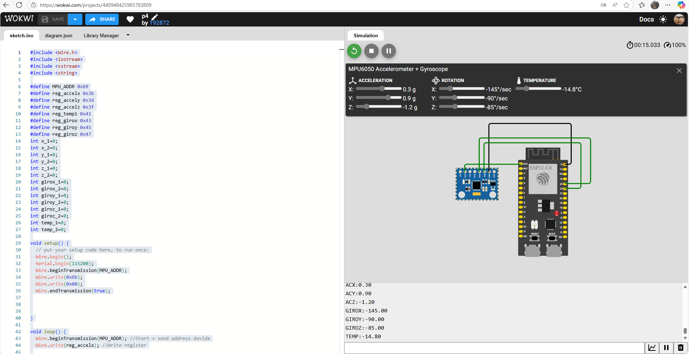

# 📚 Práctica 4: Lectura de Acelerómetro MPU6050 con Arduino

---

## 1) Resumen

- **Equipo / Autor(es):**  _Karen Najera y Arith Maldonado_
- **Curso / Asignatura:** _Elementos programables II_  
- **Fecha:** _01/09/2025_  
- **Descripción breve:** _En esta práctica se implementa un programa en Arduino para leer datos de un acelerómetro y giroscopio MPU6050 mediante comunicación I2C. El sistema recoge información de aceleración en tres ejes (X, Y, Z), velocidades angulares (giroscopio) y temperatura interna del sensor, mostrando los valores por el monitor serial._


---

## 2) Objetivos

- **General:** _Comprender el funcionamiento básico del sensor MPU6050 y su lectura mediante la comunicación I2C en Arduino.._
- **Específicos:**
  - _Inicializar correctamente el sensor MPU6050 utilizando la interfaz I2C._
  - _Leer y convertir los datos de aceleración, temperatura y giroscopio_
  - _Mostrar los valores en el monitor serial para su análisis y visualización._

## 3) Alcance y Exclusiones

- **Incluye:** _a práctica se enfoca en la lectura y visualización de los datos del sensor MPU6050, el cual proporciona información útil de aceleración, temperatura y velocidad angular._


-_Los datos se obtienen usando comunicación I2C a través de la librería Wire._

-_La salida de datos es continua y se presenta en el monitor serial cada segundo._

-_No se utiliza ninguna librería externa específica para MPU6050, se accede directamente a los registros del sensor._

-_Los valores obtenidos son procesados para mostrar aceleración en "g", temperatura en °C y giroscopio en °/s._

-_Los valores obtenidos son procesados para mostrar:


`Aceleración en g `
`Temperatura en °C`
`Giroscopio en °/s`_

---

## 4) Resultados
_Para esta práctica, se consultó la hoja de datos del MPU6050, donde se especifican las direcciones de los registros internos. Cada tipo de dato se encuentra en registros consecutivos:_


| Tipo de Dato | Dirección Base | Bytes leídos | Descripción                    |
| ------------:| --------------:| ------------:| ------------------------------ |
| Acelerómetro | `0x3B`         | 6 bytes      | X (2), Y (2), Z (2)            |
| Temperatura  | `0x41`         | 2 bytes      | Solo 1 dato (valor de 16 bits) |
| Giroscopio   | `0x43`         | 6 bytes      | X (2), Y (2), Z (2)            |


_Al ejecutar el programa cargado en el Arduino, se pudo observar que la lectura de datos del sensor MPU6050 se realizó de manera satisfactoria. Los valores de aceleración en los ejes X, Y y Z respondieron correctamente al mover físicamente el sensor, mostrando cambios en tiempo real en el monitor serial. Esto confirmó que la configuración de los registros internos del sensor y la escala aplicada a los datos fue adecuada, permitiendo representar la aceleración en unidades de "g"._

_El programa utiliza la librería Wire.h para establecer la comunicación I2C entre el Arduino y el sensor MPU6050. Esta comunicación requiere una dirección del dispositivo, en este caso 0x69, que corresponde al sensor. Cada tipo de dato (aceleración, giroscopio, temperatura) se encuentra en una posición específica de memoria interna del sensor, llamada registro. El programa accede a esos registros para leer la información.Primero, en el setup(), se inicializa la comunicación I2C (Wire.begin()) y el monitor serial (Serial.begin(115200)). Luego, se despierta el sensor escribiendo 0x00 en el registro de encendido 0x6B.El programa Lee la aceleración, luego la temperatura y por ultimo la velocidad del giroscopio, ajustando la escala a cada dato._



_En resumen, la práctica permitió obtener con éxito los tres tipos de datos proporcionados por el sensor: aceleración, velocidad angular y temperatura, validando tanto la lectura directa de registros como el procesamiento correcto de los datos. Además, se verificó la importancia de interpretar los datos como enteros con signo y de seguir la documentación oficial (datasheet) para aplicar correctamente las fórmulas y las direcciones de memoria._


---

## 6) Archivos Adjuntos

```CPP
#include <Wire.h>
#include <iostream>
#include <sstream>
#include <string>
 
#define MPU_ADDR 0x69
#define reg_accelx 0x3b
#define reg_accely 0x3d
#define reg_accelz 0x3f
#define reg_temp1 0x41
#define reg_girox 0x43
#define reg_giroy 0x45
#define reg_giroz 0x47
int x_1=0;
int x_2=0;
int y_1=0;
int y_2=0;
int z_1=0;
int z_2=0;
int girox_1=0;
int girox_2=0;
int giroy_1=0;
int giroy_2=0;
int giroz_1=0;
int giroz_2=0;
int temp_1=0;
int temp_2=0;
 
void setup() {
  // put your setup code here, to run once:
  Wire.begin();
  Serial.begin(115200);
  Wire.beginTransmission(MPU_ADDR);
  Wire.write(0x6b);
  Wire.write(0x00);
  Wire.endTransmission(true);
 
 
 
}
 
void loop() {
  Wire.beginTransmission(MPU_ADDR); //Start + send address devide
  Wire.write(reg_accelx); //Write register
 
  Wire.endTransmission(false); //Restart
  Wire.requestFrom(MPU_ADDR,6,true); // aqui se pone el numero de datos que queremos (6)
  if(Wire.available()){
    x_1 = Wire.read();
    x_2 = Wire.read();
    y_1 = Wire.read();
    y_2 = Wire.read();
    z_1 = Wire.read();
    z_2 = Wire.read();
  }
  else{
    Serial.println("Error");
  }
  Wire.endTransmission(true); //Stop
 
  Wire.beginTransmission(MPU_ADDR); //Start + send address devide
  Wire.write(reg_temp1); //Write register
 
  Wire.endTransmission(false); //Restart
  Wire.requestFrom(MPU_ADDR,2,true); // aqui se pone el numero de datos que queremos (6)
  if(Wire.available()){
    temp_1 = Wire.read();
    temp_2 = Wire.read();
   
  }
  else{
    Serial.println("Error");
  }
  Wire.endTransmission(true); //Stop
 
Wire.beginTransmission(MPU_ADDR); //Start + send address devide
  Wire.write(reg_girox); //Write register
 
  Wire.endTransmission(false); //Restart
  Wire.requestFrom(MPU_ADDR,6,true); // aqui se pone el numero de datos que queremos (6)
  if(Wire.available()){
    girox_1 = Wire.read();
    girox_2 = Wire.read();
    giroy_1 = Wire.read();
    giroy_2 = Wire.read();
    giroz_1 = Wire.read();
    giroz_2 = Wire.read();
  }
  else{
    Serial.println("Error");
  }
  Wire.endTransmission(true); //Stop
 
 
  int completo = (x_1 <<8) | x_2;
  float aceleracion_x = (float)completo / 16384.0;
  Serial.print("ACX:");
  Serial.println(aceleracion_x);
 
 
 
  int16_t completo1 = (y_1 <<8) | y_2;
  float aceleracion_y = (float)completo1 / 16384.0;
  Serial.print("ACY:");
  Serial.println(aceleracion_y);
 
  int16_t completo2 = (z_1 <<8) | z_2;
  float aceleracion_z = (float)completo2 / 16384.0;
  Serial.print("ACZ:");
  Serial.println(aceleracion_z);
 
  int16_t completo4 = (girox_1 <<8) | girox_2;
  float giro_x = (float)completo4 / 131.0;
  Serial.print("GIROX:");
  Serial.println(giro_x);
 
  int16_t completo5 = (giroy_1 <<8) | giroy_2;
  float giro_y = (float)completo5 / 131.0;
  Serial.print("GIROY:");
  Serial.println(giro_y);
 
  int16_t completo6 = (giroz_1 <<8) | giroz_2;
  float giro_z = (float)completo6 / 131.0;
  Serial.print("GIROZ:");
  Serial.println(giro_z);
 
  int16_t completo3 = (temp_1 <<8) | temp_2;
  float temperatura_1 = (float)completo3 / 340.0 + 36.53;
  Serial.print("TEMP:");
  Serial.println(temperatura_1);
 
 
  delay (1000);
}

```

## 5) Conclusión
_Esta práctica permitió poner en funcionamiento un sensor MPU6050 sin el uso de librerías externas específicas, lo cual facilita una comprensión más profunda del protocolo de comunicación I2C y de la estructura de datos del sensor. La obtención de valores crudos y su posterior escalado muestran cómo se puede traducir información binaria en datos físicos útiles.Los conocimientos adquiridos pueden aplicarse en proyectos que involucren navegación, robótica, drones, estabilizadores, entre otros. La práctica también sienta las bases para integrar múltiples sensores y realizar análisis de movimiento más avanzados.